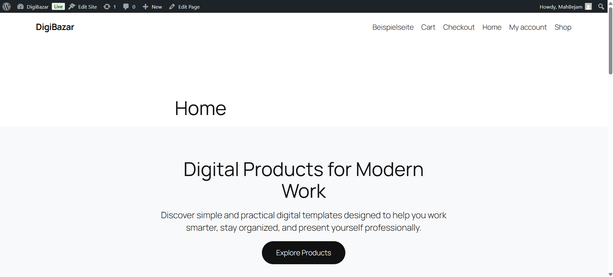
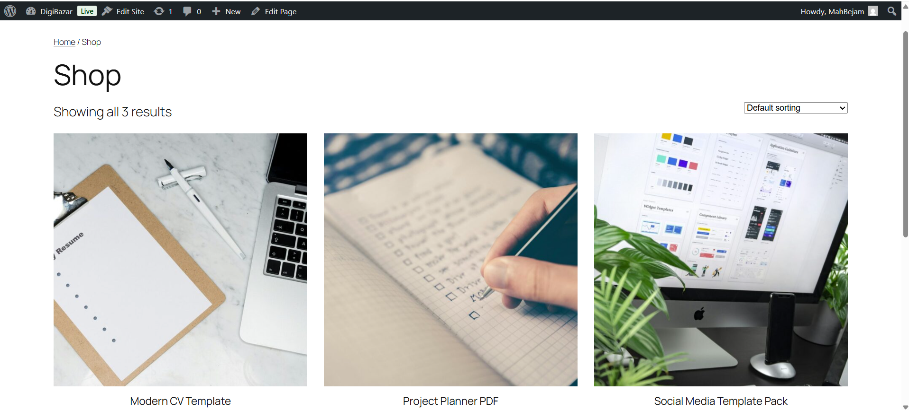
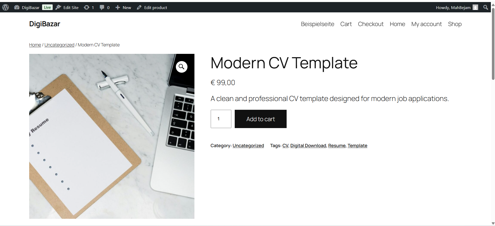

# DigiBazar Mini

## Project Overview

DigiBazar Mini is a small digital marketplace portfolio project. It demonstrates a local WordPress + WooCommerce store for virtual, downloadable products, running with Docker and MySQL.

Local site: [http://localhost:8080](http://localhost:8080)  
Admin: [http://localhost:8080/wp-admin](http://localhost:8080/wp-admin)

## Features

- WordPress with Docker
- MySQL database
- WooCommerce
- Three digital products
- Virtual and downloadable product setup
- Custom homepage
- Responsive product layout

## Technology Stack

- WordPress
- WooCommerce
- MySQL 8.0
- Docker / Docker Compose

## Sample Products

All products are virtual and downloadable demo products:

1. Modern CV Template – €9.90
2. Social Media Template Pack – €14.90
3. Project Planner PDF – €7.90

## Local Installation

1. Copy the environment file:

```powershell
Copy-Item .env.example .env
```

2. Start the containers:

```powershell
docker compose up -d
```

3. Open [http://localhost:8080](http://localhost:8080) and complete WordPress setup if needed.

4. Install and activate WooCommerce, then add your demo products (or restore from your local setup).

5. Set the **Home** page as the static homepage under **Settings → Reading**.

## Docker Commands

```powershell
docker compose up -d      # start
docker compose ps         # status
docker compose logs -f    # logs
docker compose down       # stop
```

## Project Structure

```text
DigiBazar-Mini/
├── docker-compose.yml    # WordPress + MySQL services
├── .env.example          # Safe example environment variables
├── .gitignore
├── php.ini               # PHP limits for local Docker
├── README.md
├── screenshots/          # Portfolio screenshots (add your own)
└── wordpress/            # Local wp-content mount (not committed)
    └── wp-content/
```
## Screenshots

### Homepage



### Shop Page



### Product Page



## Future Improvements

- Refine product copy and downloadable demo files
- Improve navigation and shop page layout in the block editor
- Optional staging or cloud deployment for public demos
